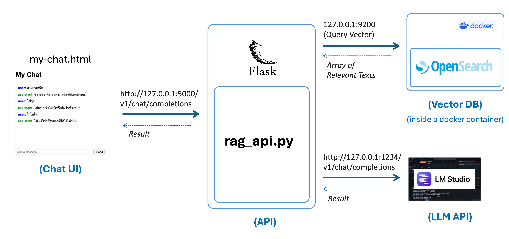

# RAG API

## Overall



## LM Studio API
* Instruction: https://github.com/LLM-CE-KMITL/python-call-lmstudio

## OpenSearch (Vector DB)
* Instruction: https://github.com/LLM-CE-KMITL/opensearch-101

## Run Flask API
```
python rag_api.py
```

## Try Chatting
* Open my-chat.html

## Example Input and Output

### Chat UI --> RAG API
* Request
```
{
   "model":"llm",
   "messages":[
      {
         "role":"system",
         "content":"You are a useful assistant."
      },
      {
         "role":"user",
         "content":"อาหารเหนือมีอะไรบ้าง"
      }
   ]
}
```

* Response
```
{
   "choices":[
      {
         "finish_reason":"stop",
         "index":0,
         "logprobs":null,
         "message":{
            "content":"ข้าวซอยเป็นอาหารเหนือที่มีเอกลักษณ์",
            "role":"assistant"
         }
      }
   ],
   "created":1745069089,
   "id":"chatcmpl-6mdiik2q7ys3fynp7ehx06",
   "model":"llama-3.2-3b-instruct",
   "object":"chat.completion",
   "system_fingerprint":"llama-3.2-3b-instruct",
   "usage":{
      "completion_tokens":17,
      "prompt_tokens":240,
      "total_tokens":257
   }
}
```

### RAG API --> LM Studio
* Request
```
json
```

* Response
```
json
```
